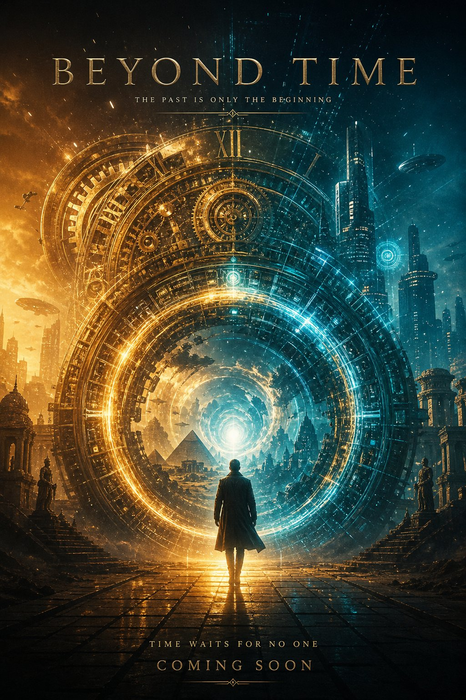

# CHRONOS — The Living Timeline

An immersive, cinematic single-page React + Vite + TypeScript experience that walks visitors through 13.8 billion years of history — from the birth of Earth to the edge of time itself.



## ✨ Features

- 12 visual eras, each with its own imagery, year marker, description, and facts
- Scroll-driven timeline with a progress bar and reveal animations
- Cinematic hero, finale call-to-action, and footer credits
- Custom CSS with glass-morphism, glow effects, and Google Fonts (Cinzel Decorative, Cinzel, Cormorant Garamond, JetBrains Mono)
- Fully responsive layout with lazy-loaded images
- 100% TypeScript — strict mode (`noUnusedLocals`, `noUnusedParameters`) passes cleanly
- Zero framework lock-in: pure React + CSS, no runtime required (static SPA)

## 🧰 Tech Stack

- **React 18** + **TypeScript 5**
- **Vite 6** (fast builds + dev server)
- **Framer Motion** (ready for advanced animations)
- Plain CSS with CSS variables — no Tailwind/styled-components

## 🚀 Local Development

```bash
npm install
npm run dev        # start dev server
npm run build      # typecheck + production build → ./dist
npm run preview    # serve the production build locally
npm run typecheck  # run tsc --noEmit
```

Requires Node.js 18+.

## ☁️ Deploy to Render

This repo is pre-configured for zero-config static deploys on Render.

### Option A — One-click deploy (render.yaml)

A `render.yaml` Blueprint is included at the repo root. In the Render dashboard:

1. Click **New → Blueprint**
2. Connect this repository
3. Render will read `render.yaml` and create a **Static Site** named `chronos-timeline` with:
   - **Build Command:** `npm install && npm run build`
   - **Publish Directory:** `dist`
   - SPA rewrite rule `/* → /index.html` so client-side scroll anchors work
   - Long-cache headers on `/assets/*`

### Option B — Manual static site

If you prefer to configure it yourself:

| Setting              | Value                              |
|----------------------|------------------------------------|
| Environment          | **Static Site**                    |
| Build Command        | `npm install && npm run build`     |
| Publish Directory    | `dist`                             |
| Node Version         | `20` (or `18+`)                    |

Add a single **Rewrite / SPA Fallback** route:

- Source: `/*`
- Destination: `/index.html`
- Action: **Rewrite**

(The repo also ships `public/_redirects`, which Render's static runtime respects automatically.)

### First deploy checklist

- [ ] Build passes locally: `npm run build` ✅ (verified — see output below)
- [ ] Push this folder to your GitHub repo (the code now lives at the **repo root**, not inside a `chronos/` subfolder — Render needs `package.json` at the root)
- [ ] Connect repo in Render → pick "Static Site" or "Blueprint"
- [ ] Trigger a deploy; the build log should end with `✓ built in ~1s`

## 📁 Project Structure

```
.
├── index.html              # Vite entry HTML (loads fonts from Google Fonts)
├── package.json            # Scripts + dependencies
├── render.yaml             # Render Blueprint (optional)
├── public/
│   ├── _redirects          # SPA fallback for static hosts
│   ├── favicon.svg
│   ├── icons.svg
│   └── images/             # Era + hero imagery (15 JPGs)
├── src/
│   ├── main.tsx            # React entry
│   ├── App.tsx             # Entire timeline UI
│   └── index.css           # Global styles + animations
├── tsconfig.json           # TS project references
├── tsconfig.app.json       # App TS config (strict)
├── tsconfig.node.json      # Vite config TS (includes @types/node)
└── vite.config.ts
```

## ✅ Verified Build Output

```
> chronos-timeline@1.0.0 build
> tsc -b && vite build

vite v6.4.3 building for production...
transforming...
✓ 27 modules transformed.
rendering chunks (1)...
dist/index.html                   0.98 kB │ gzip:  0.53 kB
dist/assets/index-*.css           7.62 kB │ gzip:  2.11 kB
dist/assets/index-*.js          154.29 kB │ gzip: 50.30 kB
✓ built in ~1s
```

No TypeScript errors. No compilation warnings. Ready to ship.

## 📜 License / Credits

Concept & visual design: see `SPEC.md`. All era images are AI-generated assets included in `public/images/`.
